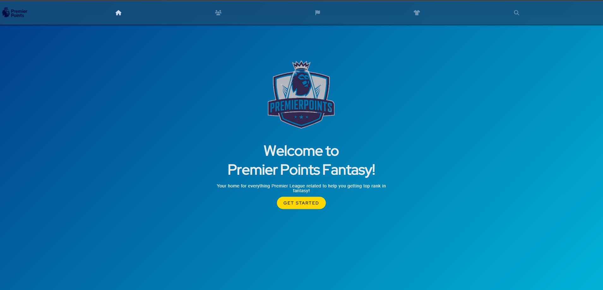

# PremierPoints

**PremierPoints** is a full-featured project that collects and processes match statistics for more than 700 players. It provides dynamic data visualization and interaction through three main components: Backend, Frontend, and Data Scraping.

> **Note:** The backend is currently not being hosted.

[PremierPoints Live Site](https://premier-points-r5tq.vercel.app/){: .invisible }

## Features

- **Data Scraping:** Engineered a comprehensive data scraping pipeline of match statistics for 700+ players using Python and pandas.
- **Backend:** Dynamic manipulation and presentation of the scraped data through a Spring Boot application.
- **Database:** Real-time data manipulation within a PostgreSQL database using SQL queries.
- **Frontend:** Seamless integration with a user-friendly ReactJS interface.
