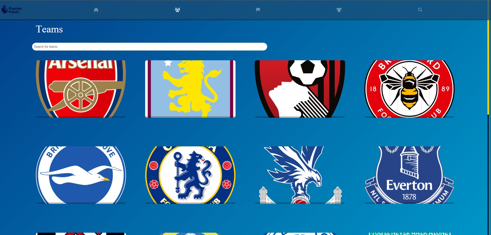
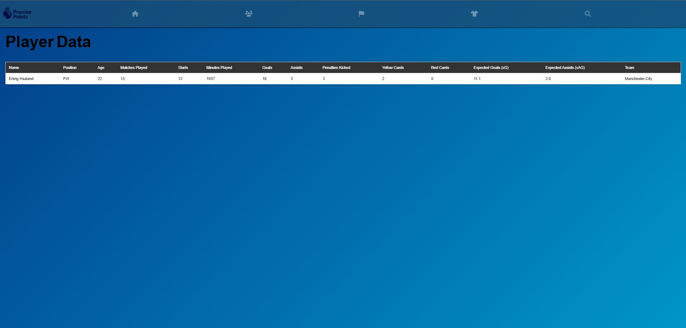

PremierPoints is a full-featured project that collects and processes match statistics for more than 700 players. It provides dynamic data visualization and interaction through three main components: Backend, Frontend, and Data Scraping.

<<<<<<< HEAD

=======

>>>>>>> 8639bf5799757e8210fa9fb5733d26d6cc73000d
